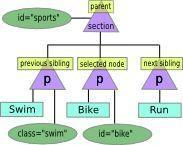

##ANOTAÇÕES LIVRO JAVASCRIPT NOVICE TO NINJA

#JSON

###JSON.parse(jsonVar);
Gera um objeto literal baseado no JSON passado no parâmetro

###JSON.stringify(jsonVar) 
Gera uma String do JSON passado no parâmetro


---------------------------------------------------


#DOM

####Níveis de Nós do DOM
Para descobrir o nível de um nó utilizamos a função **nodeType** ex:

```javascript
document.body.nodeType
```

|Code | Type |
|-----|------|
   1  |  element
   2  |	attribute
   3  |	text
   8  |	comment
   9  |	document


##Pegando elementos do DOM

Podemos usar algumas das seguintes propriedades para pegar elementos do DOM

 - ####**document.body**	
 Retorna o elemento body de uma página

 - ####**document.images**
 Retorna um **node list** de todas as imagens no documento

 - ####**document.links**	
 Retorna uma **node	list** de todos os elementos <a\> e	<area\> que tem setado um atributo	href.

 - ####**document.anchors**	
 Retorna um **node list** de todos os elementos <a\> que tem setado o atributo name.

 - ####**document.forms**
 Retorna um **node list** de todos os forms do documento.	


E também as seguintes funções:


 - ####**document.getElementById("ID do Elemento")**
 Retorna uma referência ao elemento buscado que tenha o ID setado no parâmetro da função, se o elemento não existir é retornado null.

	 	document.getElementsById('foo');
	 	retorna <p id="foo"></p>	


 - ####**document.getElementsByTagName("Nome da Tag")**
 Retorna uma **live node list** de todos os elemento da tag informada no parâmetro, ex:

	 	document.getElementsByTagName('p');
	 	retorna [<p class="foo"></p>, <p class="bar"></p>] 	


 - ####**document.getElementsByClassName("Nome da Classe")**
 Retorna uma **node list** dos elementos que tem o atributo class setado no parâmetro, ex.

 		document.getElementsByClassName('foo-bar');
 		retorna [<div class="foobar">Testing Class Name</div>]


 - ####**document.querySelector("termo de busca")**
 Retorna a primeira ocorrência do elemento especificado no parâmetro utilizando a busca de elementos do css, ex:
 **# = id** 
 **\.  =  class** 
 e assim por diante.
		
		document.querySelector("#foo");
		retorna <div id="foo">retorna do queyselector</div>


 - ####**document.querySelectorAll("termo de busca")**
 Também utiliza o modelo de query do CSS, porém retorna um **node list** com todas as ocorrências encontradas na busca, ex:

		document.querySelector(".bar");
		retorna [<div class="bar">retorno 1</div>, <p class="bar">retorno 2</p>]

	

##Node Lists (Warning)
Node lists tem um uso parecido com o dos Array porém eles não são Arrays. Por exemplo, como eles pode-se usar a notação de índice ex **document.images[0]**, utilizar a propriedade **length** ex **document.images.length**, porém não é possível usar funções específicas de Array como **.splice**, **.slice** e **.join** por exemplo. 


##Child Nodes

####childNodes
A propriedade **childNodes** retorna um **node list** de todos os elementos, textos e espaços, que são filhos do elemento utilizado na busca, ex:

	var el = document.getElementById("id-teste");
	el.childNodes

	//retorna
	[#text, <p class="foo"></p>, #text <div class="bar"></div>, #text]


####firstChild
A propriedade **firstChild** retorna somente o primeiro de todos os elementos, textos e espaços, que são filhos do elemento utilizado na busca, ex:

	var el = document.getElementById("id-teste");
	el.firstChild

	//retorna
	[#text]


####lastChild
A propriedade **lastChild** retorna somente o último de todos os elementos, textos e espaços, que são filhos do elemento utilizado na busca, ex:

	var el = document.getElementById("id-teste");
	el.lastChild

	//retorna
	[#text]


####children
A propriedade **children** retorna um **node list** somente com os **elementos** que são filhos do elemento utilizado na busca, ou seja, espaços e textos não são retornados, ex:

	var el = document.getElementById("id-teste");
	el.childNodes

	//retorna
	[<p class="foo"></p>, <div class="bar"></div>]


------------------------------------------


##Recuperando atributos

O Javascript utiliza as seguintes funções para manipular atributos dos elementos:


###getAttribute("atributo");
Recupera o atributo passado como parâmetro, exemplo:

	var tag = document.getElementById("tag-teste");
	var attrib = tag.getAttribute("charset");
	console.log(attrib); //utf-8


###setAttribute("atributo", "valor");
O comando setAttribute modifica um atributo ou adiciona caso o mesmo não exista na tag, exemplo:

	var tag = document.getElementById("tag-teste");
	tag.setAttribute("class", "container");


###Funções Legadas - .className e .id
Estas funções legadas do DOM permitem acessar esses atributos diretamente, exemplo:

	<p class="foo" id="bar">showTime</p>
	
	var tag = document.getElementsByClassName('foo')[0];
	tag.id  // bar
	tag.className //foo

Também podemos utilizar a propriedade **clasName** para alterar a classe do elemento, ex:

	tag.className = "nova-classe";


###Propriedade classList

A propriedade **classList** retorna uma lista contendo todas as classes do elemento, ela também pussui alguns métodos para alterar esta lista e afins, ex:

**Add**
Este método adiciona a classe passada no parâmetro à lista de classes do elemento, ex:
	
	tag.classList.add('foobar'); //retorna undefined		

**Remove**
Este método remove um classe passada no parâmetro da lista de classes do elemento, ex:

	tag.classList.remove('foobar');	//retorna undefined

**Toggle**
Este método recebe um nome de classe como parâmetro, e caso a classe não exista no elemento		

--------------------------------------------------

#Navegação no DOM

Tendo a referência de um elemento é possível navegar pelo DOM avançando ou voltando nós utilizando o elemento como referência:



##Navegação


####element.parentNode
Retorna o elemento pai do elemento em questão

####element.nextSibling
A **propriedade** nextSibling retornará o próximo nó irmão do elemento em questão caso o mesmo seja o último filho é retornado null.

####element.previousSibling
A mesma ideia do nextSibling, porém retorna o nó anterior.


---------------------------------------

#Pegando o valor de um Nó

Uma forma mais complexa de pegar o texto de um elemento, é a seguinte:

```javascript
	var conteudoTxtNode = elemento.firstChild;
	var conteudo = conteudoTxtNode.nodeValue;	
```

Uma forma mais simples de pegar este valor é utilizando a propriedade **textContent**:

```javascript
	var texto = elemento.textContent;
```
**Obs:** A propriedade **textContent** não funciona no IE8 e abaixo, nestes casos pode-se usar a propriedade **innerText** que funciona de forma similar.


