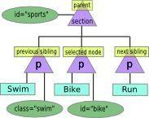

# ANOTAÇÕES JAVASCRIPT NOVICE TO NINJA

# JSON

### JSON.parse(jsonVar);
Gera um objeto literal baseado no JSON passado no parâmetro

### JSON.stringify(jsonVar) 
Gera uma String do JSON passado no parâmetro


---------------------------------------------------


# DOM

#### Níveis de Nós do DOM
Para descobrir o nível de um nó utilizamos a função **nodeType** ex:

```javascript
document.body.nodeType
```

|Code | Type |
|-----|------|
   1  | element
   2  |	attribute
   3  |	text
   8  |	comment
   9  |	document


## Pegando elementos do DOM

Podemos usar algumas das seguintes propriedades para pegar elementos do DOM

#### document.body	
 Retorna o elemento body de uma página

#### document.images
 Retorna um **node list** de todas as imagens no documento

#### document.links	
 Retorna uma **node	list** de todos os elementos <a\> e	<area\> que tem setado um atributo	href.

#### document.anchors	
 Retorna um **node list** de todos os elementos <a\> que tem setado o atributo name.

#### document.forms
 Retorna um **node list** de todos os forms do documento.	


E também as seguintes funções:


#### document.getElementById("ID do Elemento")
 Retorna uma referência ao elemento buscado que tenha o ID setado no parâmetro da função, se o elemento não existir é retornado null.

```javascript
document.getElementsById('foo');
retorna <p id="foo"></p>	
```


#### document.getElementsByTagName("Nome da Tag")
 Retorna uma **live node list** de todos os elemento da tag informada no parâmetro, ex:

```javascript
document.getElementsByTagName('p');
retorna [<p class="foo"></p>, <p class="bar"></p>] 	
```


#### document.getElementsByClassName("Nome da Classe")
 Retorna uma **node list** dos elementos que tem o atributo class setado no parâmetro, ex.

```javascript
document.getElementsByClassName('foo-bar');
retorna [<div class="foobar">Testing Class Name</div>]
```


#### document.querySelector("termo de busca")
 Retorna a primeira ocorrência do elemento especificado no parâmetro utilizando a busca de elementos do css, ex:
 **# = id** 
 **\.  =  class** 
 e assim por diante.

```javascript		
document.querySelector("#foo");
retorna <div id="foo">retorna do queyselector</div>
```


#### document.querySelectorAll("termo de busca")
 Também utiliza o modelo de query do CSS, porém retorna um **node list** com todas as ocorrências encontradas na busca, ex:

```javascript
document.querySelector(".bar");
retorna [<div class="bar">retorno 1</div>, <p class="bar">retorno 2</p>]
```
	

## Node Lists (Warning)
Node lists tem um uso parecido com o dos Array porém eles não são Arrays. Por exemplo, como eles pode-se usar a notação de índice ex **document.images[0]**, utilizar a propriedade **length** ex **document.images.length**, porém não é possível usar funções específicas de Array como **.splice**, **.slice** e **.join** por exemplo. 


## Child Nodes

#### childNodes
A propriedade **childNodes** retorna um **node list** de todos os elementos, textos e espaços, que são filhos do elemento utilizado na busca, ex:

```javascript
var el = document.getElementById("id-teste");
el.childNodes

//retorna
[#text, <p class="foo"></p>, #text <div class="bar"></div>, #text]
```

#### firstChild
A propriedade **firstChild** retorna somente o primeiro de todos os elementos, textos e espaços, que são filhos do elemento utilizado na busca, ex:

```javascript
var el = document.getElementById("id-teste");
el.firstChild

//retorna
[#text]
```

#### lastChild
A propriedade **lastChild** retorna somente o último de todos os elementos, textos e espaços, que são filhos do elemento utilizado na busca, ex:

```javascript
var el = document.getElementById("id-teste");
el.lastChild

//retorna
[#text]
```


#### children
A propriedade **children** retorna um **node list** somente com os **elementos** que são filhos do elemento utilizado na busca, ou seja, espaços e textos não são retornados, ex:

```javascript
var el = document.getElementById("id-teste");
el.childNodes

//retorna
[<p class="foo"></p>, <div class="bar"></div>]
```

------------------------------------------


## Recuperando atributos

O Javascript utiliza as seguintes funções para manipular atributos dos elementos:


### getAttribute("atributo");
Recupera o atributo passado como parâmetro, exemplo:

```javascript
var tag = document.getElementById("tag-teste");
var attrib = tag.getAttribute("charset");
console.log(attrib); //utf-8
```

### setAttribute("atributo", "valor");
O comando setAttribute modifica um atributo ou adiciona caso o mesmo não exista na tag, exemplo:

```javascript
var tag = document.getElementById("tag-teste");
tag.setAttribute("class", "container");
```

### Funções Legadas - .className e .id
Estas funções legadas do DOM permitem acessar esses atributos diretamente, exemplo:

```javascript
<p class="foo" id="bar">showTime</p>

var tag = document.getElementsByClassName('foo')[0];
tag.id  // bar
tag.className //foo
```

Também podemos utilizar a propriedade **clasName** para alterar a classe do elemento, ex:

```javascript
tag.className = "nova-classe";
```

### Propriedade classList (IE10+)

A propriedade **classList** retorna uma lista contendo todas as classes do elemento, ela também pussui alguns métodos para alterar esta lista e afins, ex:

**Add**
Este método adiciona a classe passada no parâmetro à lista de classes do elemento, ex:
	
```javascript
tag.classList.add('foobar'); //retorna undefined		
```

**Remove**
Este método remove um classe passada no parâmetro da lista de classes do elemento, ex:

```javascript
tag.classList.remove('foobar');	//retorna undefined
```

**Toggle**
Este método recebe um nome de classe como parâmetro, e caso a classe não exista no elemento
ele adiciona e retorna true, caso exista, ele remove e retorna false.

```javascript
tag.classList.toggle('foobar');	//retorna true
```		


**Contains**
Este método verifica se o elemente possui a classe especificada

```javascript
tag.classList.contains('foobar'); //retorna true
```


## Adicionando Classe com função de fallback pra IEs antigos

```javascript
function addClass(element,newClass){
	if (element.className) {
		element.className	=	swim.className	+	”	”	+	newClass;
	}else{
		element.className	=	newClass;
	}
	return	element.getAttribute(“class”);
}
```


--------------------------------------------------

# Navegação no DOM

Tendo a referência de um elemento é possível navegar pelo DOM avançando ou voltando nós utilizando o elemento como referência:



## Navegação


#### element.parentNode
Retorna o elemento pai do elemento em questão

#### element.nextSibling
A **propriedade** nextSibling retornará o próximo nó irmão do elemento em questão caso o mesmo seja o último filho é retornado null.

#### element.previousSibling
A mesma ideia do nextSibling, porém retorna o nó anterior.


---------------------------------------

# Pegando o valor de um Nó

Uma forma mais complexa de pegar o texto de um elemento, é a seguinte:

```javascript
	var conteudoTxtNode = elemento.firstChild;
	var conteudo = conteudoTxtNode.nodeValue;	
```

Uma forma mais simples de pegar este valor é utilizando a propriedade **textContent**:

```javascript
	var texto = elemento.textContent;
```
**Obs:** A propriedade **textContent** não funciona no IE8 e abaixo, nestes casos pode-se usar a propriedade **innerText** que funciona de forma similar.


------------------------------------------


# Adicionando Nó ao final do conteúdo

### appendChild(novoElemento);

É possível adicionar um nó ao final do conteudo de um elemento, ou seja, fazer um append, exemplo:

```javascript
	var newChild = document.createElement('p');
	newChild.textContent = 'Novo elemento filho';
	document.body.appendChild(newChild);
```

Como visto acima, o método appendChild deve ser usado no elemento pai.


# Adicionando nó antes de algum elemento

### insertBefore(novoElemento, elementoAlvo);

Para adicionar um nó antes de qualquer elemento, primeiro é preciso ter a referência do elemento pai e do elemento do qual se deseja inserir o nó antes, e depois utilizar o método **insertBefore()**, exemplo:

```javascript
	var topEl = document.body;
	var newChild = document.createElement('p');
	newChild.textContent = 'Novo elemento';
	var elReference = document.getElementById('elemento-qualquer');

	//dentro de body insere newChild antes de elReference
	topEl.insertBefore(newChild, elReference); 
```

#### Obs: Os métodos appendChild e insertBefore servem tanto para novos elementos quanto para elementos já existentes na página.


# Removendo Elemento da página

### removeChild(elementoAlvo);

Para remover um elemento da página é necessário utilizar o método **removeChild()**, o método deverá ser chamado no elemento pai, assim como **appendChild()** e **insertBefore()**, exemplo:

```javascript
	var newChild = document.createElement('p');
	newChild.textContent = 'Novo elemento filho';
	document.body.appendChild(newChild);
	document.body.removeChild(newChild);//removendo elemento
```


# Substituindo elementos

### replaceChild(novoElemento, elementoAlvo);

Para substituir elementos na página utilizamos o método **replaceChild()**, o método assim como os outros deve ser chamado no elemento pai, exemplo:

```javascript
	var newChild = document.createElement('p');
	newChild.textContent = 'Novo elemento filho';
	var newDiv = document.createElement('div');
	
	document.body.appendChild(newChild);
	document.body.replaceChild(newDiv, newChild);//substituindo elemento
```


## Atualizando CSS
Todo elemento nó tem uma propriedade **style**, com ela é possível alterar dinamicamente o CSS dos elementos, exemplo:

```javascript
	var el = document.getElementById('elemento');
	el.style.border = '1px solid #ccc';
```
**Obs:** As propriedades CSS que tem seus nomes separados por **-** devem sem referenciadas em camelcase, exemplo:

```javascript
	var el = document.getElementById('elemento');
	el.style.backgroundColor = '#f8f8f8';
```


## Descobrir estilos aplicados ao elemento
A função **getComputedStyle** traz um vetor com as propriedades CSS aplicadas ao elemento, exemplo:

```javascript
	var el = document.getElementById('elemento');
	var estilos = getComputedStyle(el);
```

E para procurar um atributo em específico dentro do retorno desta função, utiliza-se a função **getPropertyCSSValue('atributo').cssText**, exemplo:

```javascript
	var el = document.getElementById('elemento');
	var estilos = getComputedStyle(el);
	estilos.getPropertyCSSValue('color').cssText;
```
A função acima busca o atributo **color** dentro do retorno dos estilos.


------------------------------------

# Eventos

### Event Listeners

Event Listeners são os ouvintes de eventos em JS, com eles é possível programar uma função para que esta só ocorra quando o evento acontecer, em vez de ficar validando se algo acontece.

### addEventListener

A funçao addEventListener é responsável por criar um ouvinte de evento, sua assinatura é bem simples:

**elemento.addEventListener('tipo-de-evento', função-de-callback(objeto event como parâmetro))**

Como ilustrado acima, a função addEventListener deve ser associada a algum elemento, pois assim como variáveis, ouvintes globais não são muito recomendados, seus parâmetros são: Primeiro uma **string** com o tipo do evento e em seguida uma função de callback, esta função pode receber o objeto event caso seja preciso tratar informações do evento dentro do callback, exemplos:

##### Ouvinte comum

```js
	var botao = document.getElementById('btn-send');//recupera o elemento do DOM
	botao.addEventListener('click', function () {
		alert('O cara clicou no botao');
	});
```


##### Tratando informação do Evento

```js
	var botao = document.getElementById('btn-send');//recupera o elemento do DOM
	botao.addEventListener('click', function (evento) {
		alert('O tipo do evento é ' + evento.type); //exibe O tipo do evento é click
	});
```


## Propriedades do Evento

### event.type 
Retorna o tipo do evento

### event.target 
Retorna o elemento que disparou o evento

```js
	var botao = document.getElementById('btn-send');//recupera o elemento do DOM
	botao.addEventListener('click', function (evento) {
		alert(evento.target); //<button id="btn-send">Enviar</button>
	});
```


### event.screenX
Retorna a posição **horizontal** na tela do elemento que disparou o evento, esta posição é calculada da esquerda para a direita.

```js
	var botao = document.getElementById('btn-send');//recupera o elemento do DOM
	botao.addEventListener('click', function (evento) {
		alert(evento.screenX);
	});
```


### event.screenY
Retorna a posição **vertical** na tela do elemento que disparou o evento, esta posição é calculada de cima para baixo.

```js
	var botao = document.getElementById('btn-send');//recupera o elemento do DOM
	botao.addEventListener('click', function (evento) {
		alert(evento.screenY);
	});
```


### event.pageX/Y
Retorna a posição **horizontal/vertical** na tela do elemento que disparou o evento, esta posição é calculada levando em conta o Scroll da página


### event.which
Retorna qual botão do Mouse ou tecla foi pressionado(a), exemplo:
```js
	var botao = document.getElementById('btn-send');//recupera o elemento do DOM
	botao.addEventListener('click', function (evento) {
		alert(evento.which);
	});
```


## Tipos de Eventos

# Mouse Events
Utilizando a variavel botao para os eventos de mouse a seguir
```js
	var botao = document.getElementById('btn-send');//recupera o elemento do DOM
```


## MouseDown
Evento que ocorre quando o botão do mouse é pressionado antes do evento de click:
```js
	botao.addEventListener('mousedown', function (evento) {
		console.log('down');
	});
```


## Click
Evento que ocorre quando o botão do mouse é pressionado após o evento de mousedown:
```js
	botao.addEventListener('click', function (evento) {
		console.log('click');
	});
```


## MouseUp
Evento que ocorre quando o botão do mouse é pressionado após o evento de click:
```js
	botao.addEventListener('mouseup', function (evento) {
		console.log('up');
	});
```


## Double Click
Evento que ocorre no Double Click no mouse:
```js
	botao.addEventListener('dblclick', function (evento) {
		console.log('Double Click');
	});
```


##MouseOver
Evento que ocorre quando o ponteiro do mouse é posicionado sobre o elemento:
```js
	botao.addEventListener('mouseover', function () {
		console.log('O mouse esta sobre o botão');
	});
```


##MouseOut
Evento que ocorre quando o ponteiro do mouse sai da area do elemento:
```js
	botao.addEventListener('mouseout', function () {
		console.log('O mouse saiu');
	});
```


##MouseMove
Evento que ocorre enquanto o mouse for movimentado:
```js
	botao.addEventListener('mousemove', function () {
		console.log('O mouse esta se movimentando sobre o botao');
	});
```


##Exemplo alterando classe css no evento de Double Click
Exemplo para alterar a classe de uma certa tag no evento double click
```js
	botao.addEventListener('dblclick', highlight);
	function highlight (event) {
		event.target.classList.toggle("highlight");
	}
```


#Keyboard Events
Há três eventos que ocorrem quando uma tecla é pressionada:	 **keydown, keypress e keyup**.
No momento que a tecla é pressionada os eventos citados ocorrem na ordem citada acima. A Informação sobre qual tecla foi pressionada é uma propriedade do Objeto **Event**.
Algumas Observações:

1. O evento de **Keydown** ocorre quando a tecla é pressionada e continuará ocorrendo enquanto a mesma permanecer pressionada.

1. O evento **Keypress** ocorre depois do Keydown e antes do Keyup, **ele só ocorre para teclas que produzem algum caractere de entrada** e é a forma mais confiável de saber qual caractere foi digitado. 

1. O evento **Keyup** ocorre ao soltar da tecla.

####Keyup Exemplo

```js
	addEventListener('keyup', function stop(event) {
	  var date = new Date;
	  console.log("Voce parou de pressionar a tecla em " + date);

	});
```


Os Objetos de Evento **keyup** e **keydown** ambos tem uma propriedade chamada **event.keyCode** que retorna uma código numérico que representa a tecla que disparou o evento.

O Objeto de Evento **keypress** tem uma propriedade chamada **event.charCode** que retorna um caractere numérico Unicode que representa o caractere que será mostrado na tela.

Obs: O método **String.fromCharCode()** converte a propriedade event.charCode para um caractere String.


####Pra saber qual tecla foi pressionada utilize o evento keydown e a propriedade event.keyCode.

####Pra saber qual caractere será impresso na tela utilize o evento keypress e a propriedade event.keyChar.

Criando uma função pra listar o caractere da tecla pressionada no evento **keypress**.

```js
	addEventListener('keypress', function (event) {
		console.log("Voce pressionou a tecla com o aractere " + String.fromCharCode(event.charCode));
	});
```


####Teclas Modificadoras
As teclas modificadores **Shift, Ctrl, Alt e meta(Cmd no Mac)** são teclas quue disparam os métodos **keyup** e **keydown** mas **não** disparam o método **keypress** pois as mesmas não criam caracteres de entrada. Elas possuem propriedades específicas para identificar se elas foram pressionadas, exemplo: **event.shiftKey**, **event.ctrlKey**, **event.altKey**, **event.metaKey**. Essas propriedades retornam **true** caso a tecla tenha sido pressionada e **false** caso o contrário, exemplo:

```js
	addEventListener('keydown', function (event) {
		if(event.shiftKey && event.ctrlKey)
			console.log('As teclas shift e control foram pressionadas');
	});
```


É possível também verificar se a tecla está sendo pressionada mesmo durante outros eventos, por exemplo verificar se a tecla **control** está pressionada durante o evento **click** do mouse:

```js
	addEventListener('click', function (event) {
		if(event.ctrlKey)
			console.log('Tecla Controle pressionada durante o evento de click do mouse');
	});
```

**Obs:** Cuidado ao usar as teclas modificadoras, pois elas normalmente já possuem alguma função reconhecida pelo Browser, neste caso para previnir o comportamento padrão usa-se **event.preventDeafult()** o que ainda assim também não é muito recomendado.


-----------------------------------------------------------------------

#Touch Events


-----------------------------------------------------------------------

#Removendo Event Listeners

Um Event Listener pode ser removido através da método removeEventListener(), exemplo:

```html
	<p id="once">Testes removendo ouvintes</p>
```

```js
	once = document.getElementById('once');

	once.addEventListener('click', remove);

	function remove(event) {
		console.log('Aproveite enquanto dura');
		once.style.backgroundColor = "red";
		once.removeEventListener('click', remove);
	}
```

####Obs: Não utilize função anônima como argumento do método addEventListener caso queira remover o ouvinte posteriormente, pois o método removeEventListener precisa de uma referência da função para desvincular o evento.


------------------------------------------------------------------

#Evitando Comportamento Padrão

Alguns elementos tem alguns comportamentos padrão com certos eventos. Por exemplo, quando um usuário clica em um link, o navegador o redirecionado para o endereço especificado no atributo href, ou quando o usuário clica em submit de um form, o navegador redireciona e envia os dados para o endereço especificado no atributo action.

**preventDeafult** é um método do objeto **event** que pode ser utilizado na função de callback para evitar o comportamento padrão, exemplo:

```html
	<p><a href="http://sitepoint.com" id="broken">Link quebrado</a></p>
```

```js
	var broken = document.getElementById('broken');
	broken.addEventListener('click', functiom (event) {
		event.preventDefault();
		console.log('Comportamento default cancelado!');
	});

```

-----------------------------------------------------------------------

#Event Propagation

Quando você clica em um elemento, você está também clicando em todos os elementos que estão aninhados dentro dele. Exemplo:

```html
	<ul id="list">
		<li>one</li>
		<li>two</li>
		<li>three</li>
	</ul>	
```

No html acima, se você clicar em qualquer uma das **li**, você também estará clicando no **ul** e também no **body**, ou seja, o evento é **propagado** para os nós acima.

##Event Propagation
É a ordem em que os eventos são disparados em cada elemento, há duas formas de propagação de eventos: **bubbling** e **capturing**.

##Bubbling
É quando o evento dispara primeiramente no elemento clicado, e a seguir **espalha** para os elementos acima na árvore de documentos, disparando o evento em cada elemento pai até chegar no root node.

##Capturing
Começa disparando o evento no elemento root, e a seguir **espalha** para os elementos abaixo na árvore de documentos, disparando o evento em cada elemento filho até chegar no elemento alvo que disparou o evento.

#####Obs: O comportamento padrão é o Bubbling


####Exemplo com Bubbling

```js
	var ul = document.getElementById("list");
	var li = document.querySelector("#list li");

	ul.addEventListener('click', function (event) {
		console.log('Clicou na UL');
	});

	li.addEventListener('click', function (event) {
		console.log('Clicou na LI');
	});

```

No código acima quando clicarmos no primeiro item da lista(pois ele é o alvo do querySelector em questão) será exibido no console a mensagem **Clicou na LI**, porém logo após o evento é propagado para o elemento pai de li,e como colocamos também um listener em ul, também será exibida no console a mensagem **Clicou na UL**, e o evento se propagrá para todos os elementos pai li, porém nada ocorrerá pois não adicionamos listeners para os outros elementos.


####Exemplo com Capturing

O método **addEventListener** tem um terceiro parâmetro, que é um valor booleano que especifica se o **capturing** será utilizado ou não. Por padrão este parâmetro é **false**(por isso o Bubbling é o padrão).
Haverá ocasiões em que será necessário disparar o evento nos elementos mais externos antes do elemento alvo, nestes tipos de caso o uso do Capturing vem bem a calhar, exemplo:

```js
	ul.addEventListener('click', function (event) {
		console.log('Clicou na UL');
	}, true);

	li.addEventListener('click', function (event) {
		console.log('Clicou na LI');
	}, true);
```

No exemplo acima, quando clicar no primeiro item da lista, primeiro será exibido no console **Clicou na UL** para em seguida ser exibido **Clicou na LI**, este é o efeito do Capturing, executando primeiro os eventos externos para depois os mais internos até chegar ao elemento alvo que disparou o evento.

Caso queira utilizar tanto o Bubbling quanto o Capturing, deverá criar um listener para cada um, exemplo:

```js
	ul.addEventListener('click', function (event) {
		console.log('Clicou na UL');
	}, true);

	ul.addEventListener('click', function (event) {
		console.log('Clicou na UL');
	}, false);
```


##Evitando o Bubbling
É possível evitar o efeito do Bubbling chamando o método **event.stopPropagation()** no final da função de callback, fazendo isso o evento ocorrerá somente no elemento alvo, e não será propagado para os elementos pais, exemplo:

```js
	li.addEventListener('click', function (event) {
		console.log('Clicou no LI');
		event.stopPropagation();
	}, false);
```

No exemplo acima, será exibida a mensagem **Clicou no LI** e em seguida a propagação do evento será cancelada.

**Obs:** Cuidado ao utilizar o **stopPropagation()** para o evitar o Bubbling, pois pode ser que haja alguns outros eventos vinculados aos elmentos pais do elemento alvo e que neste caso serão obstruídos.


----------------------------------------------------------

#Event Delegation

Event Delegation é utilizado aplicando um Event Listener no elemento pai visando capturar os eventos que ocorrem nos elementos filhos, exemplo:

Imagine uma **tabela** com **100 linhas por 100 colunas**, neste cenário seria muito complicado tratar os eventos ocorridos em cada **<tr>** ou **<td>** por exemplo, neste caso adiciona-se o **Event Listener** no elemento **<table>** e descobrir qual elemento filho chamou o evento através do **event.target**, exemplo:

```html
	<table id="tabela1">
		<tr>
			<td></td>
			<td></td>
		</tr>
		<tr>
			<td></td>
			<td></td>
		</tr>
	</table>
```

```js
	var tabela = document.getElementById("tabela1");
	tabela.addEventListener('click', function (event) {
		console.log("O evento foi disparado pelo elemento " + event.target);
	});
```

Este é um método bastante interessante, pois como ele é possível adicionar listener aos elementos adicionados dinamicamente ao DOM, assim que os mesmo entrarem na árvore do objeto ele herdam o listener.


----------------------------------------

#Forms


Existe mais de uma maneira de recuperar um form de uma página com JS, vaja algumas:

###document.forms[indice]
Este é um método legado do DOM, ou seja, um método antigo que traz um Array de todos os forms encontrados no documento, e para acessar o form desejado usa-se o acesso pelo índice, exemplo:

```js
	var form = document.forms[0]; //retorna o primeiro form encontrado declarado no documento

```


###document.getElementsByTagname('form')[indice]
Este método também traz todos os forms do documento em Array, exemplo:

```js
	var form = document.getElementsByTagname('forms')[0]; //retorna o primeiro form encontrado declarado no documento
```


###Recuperando Form pelo Nome

É possível também identificar um form pelo atributo name:

```js
	var form = document.forms.search;
```

**Obs**: Cuidado ao nomear um form e tentar referenciá-lo pelo atributo nome, pois nomes que correspondem a atributos do **Objeto Form**, como **submit** por exemplo, referenciarão à propriedade do form e não ao name que você definiu. 

Para evitar este problema o aconselhável é utilizar as chaves pra referenciar o nome do form, exemplo:

```js
	var form  = document.forms['formContato']; //retorna o form com name formContato
```


###Recuperando elementos do Form
O Objeto **Form** possui também um método chamado elements, este método retorna todos os elementos contidos nele em um Array, exemplo:

```js
   var form = document.forms[0].elements;
   //retorna [<input type=​"text" name=​"searchBox">​, <button type=​"submit">​Search​</button>​]
```

Assim como os atributos do form, os elementos também podem ser acessado pelos seus names, também é aconselhável utilizar a notação com colchetes para referenciar os nome, exemplo:

```js
	var form = document.forms['formContato'];
	form.elements['email'];
	//retorna <input type="email" name="email">
```


##Propriedades e Métodos do Form
O Objeto **Form** possui métodos e propriedades que podem interagir com o formulário.

####Submit
O método **form.submit()** irá submeter automaticamente o formulário.Note que utilizando este método não irá ativar o Evento de Submit.

####Reset
O método **form.reset()** irá resetar todos os valores do form e seus elementos ao estado inicial.

####Action
Para alterar o destino para o qual o form será enviado pode-se utilizar a propriedade **form.action**.


##Eventos de Formulário


