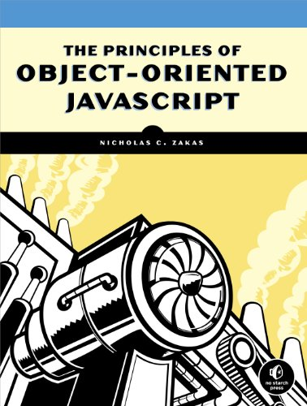

# Minhas Anotações do Livro




-----------------------------------------

## 1. Primitive and Reference Types

### Criando um Objeto
Uma forma simples de criar um objeto é através do operador **_new_**, exemplo:

```javascript
  var ob1 = new Object();
```
No exemplo acima, o que é referenciado na variável **ob1** não é diretamente o objeto, e sim um ponteiro de memória com a referência do Objeto.


### Adicionando propriedades ao Objeto
Para adicionar uma propriedade(seja ela atributo ou método) em objetos no JS, é bem simples, veja o exemplo:

```javascript
  var ob1 = new Object();
  var ob2 = ob1
  ob1.meuNovoAtributo = "Show de Bola";
  console.log(ob2.meuNovoAtributo); // "Show de Bola"
```
Como visto acima, pelo fato de ambas as variáveis **ob1** e **ob2** manterem um ponteiro como referência em vez objeto em si, quando foi adicionado a propriedade **meuNovoAtributo** a **ob1**, automaticamente **ob2** também obteve o mesmo atributo.


###Criando um Objeto de forma literal
Existe uma forma abreviada e mais limpa de criar objetos em JS que utilizando a sintaxe **literal**, da seguinte forma:

```javascript
  var ob1 = {
    meuNovoAtributo: "Show de Bola",
    meuMetodo: function () {
      console.log(meuNovoAtributo)
    }
  };
```

A sintaxe do Objeto Literal é a seguinte:

1. Deve ser declarado entre chaves **{}**
1. As propriedades devem ser separadas por vírgula **,**
1. O separador de Chave e Valor deve ser o dois-pontos **:**  
1. Os métodos são declarados utilizando funções


### Identificando tipos

#### Arrays
A melhor e mais confiável forma de identificar Array é através do método **Array.isArray(myArray)**, exemplo:

```javascript
  var arr = [];
  Array.isArray(arr); // true
```

**Obs:** Este método não é suportado no IE8 e anteriores.


#### Objetos

##### instanceof
Como em JS praticamente todos os tipos herdam de Object se compararmos utilizando **typeof** muitos irão retornar object, para estes casos utiliza-se **instanceof**, exemplo:

```javascript

  var items = [];
  var object = {};
  function reflect(value) {
  return value;
  }
  console.log(items instanceof Array); // true
  console.log(object instanceof Object); // true
  console.log(reflect instanceof Function); // true
```

##### typeof
O typeof somente consegue ser preciso quando se trata de funções, em outros casos normalmente ele identifica como objeto, exemplo:

```javascript
  var fn = function () {};
  console.log(typeof fn); // "function"
```


#### Primitive Wrapper Types
Uma das mais confusas partes do Javascript são os empacotadores de tipos primitivos(String, Number, Boolean).
Eles existem para fazer com que os tipos primitivos trabalhem de forma parecida com Objetos. Eles são criados automaticamente por trás dos panos sempre que um tipo primitivo é lido, e se este tipo precisa utlizar alguma função object-like, os Wrappers entram em ação, exemplo:

```javascript
  var nome = "Denis";
  var primeiroCaracter = nome.charAt(0);
  console.log(primeiroCaracter);  //"D"
```
Quando o trecho de código acima é executado, isso é o que acontece por trás dos panos:

```javascript
  var nome = "Denis";
  var temp = new String(nome); //aqui o wrapper é criado para trabalhar as funções de objeto da string
  var primeiroCaracter = temp.charAt(0);
  temp = null; //agora que ja fez seu papel o wrapper é destruido
  console.log(primeiroCaracter);
```
Como visto acima, pelo fato de o tipo primitivo(**string**) trabalhar como um objeto, a Engine do Javascript cria uma instância de **String**, por isso a função **charAt(0)** funciona. O objeto String existe somente por umbreve momento antes de ser destruído, este processo é conhecido como **_autoboxing_**.

Vamos ver outro exemplo:

```javascript
  var name = "Denis";
  name.last = "Nunes";
  console.log(name.last);  //undefined
```
O código acima, tenta efetuar um procedimento que é comumente aplicado a qualquer objeto, ou seja, adicionar uma propriadade qualquer a ele, porém no tipo primitivo, como as propriedas são criadas no Wrapper, quando elas são chamadas, o Wrapper já foi destruído, e por isso temos o resultado de **undefined**, vamos ver como a engine processa o exemplo acima:

```javascript
  //como as coisas ocorrem por tras do panos =D
  var name = "Denis";
  var temp = new String(name);
  temp.last = "Nunes";
  temp = null; //objeto temporario é detruido aqui

  var temp = new String(name);
  console.log(temp.last); // undefined
  temp = null;
```

Como visto acima o Wrapper é destruido antes de ser chamado no console.log, e é novamente criado para exibir a propriedade **last**, que neste momento já não existe mais.


Apesar de o fato dos Wrappers de tipos primitivos serem criados automaticamente, quando são verificados com **instanceof**, ele retornam **false**, exemplo:

```javascript
  var name = "Denis";
  var count = 10;
  var found = false;

  console.log(name instanceof String); //false
  console.log(count instanceof Number); //false
  console.log(found instanceof Boolean); //false
```
As comparações retornam **false**, porque os Wrappers só são criados quando um valor é lido pela engine, e a função **instanceof** não faz a leitura dos valores, e por isso os Wrappers não são criados e as comparações retornam false.

Para comparar tipos primitivos usa-se a função **typeof()**, porém a mesma não funciona com **null**, ele deve ser comparado com ele mesmo(**null**).

---------------------------
## Functions

Em JS Funções são também objetos, porém o que as diferencia de objetos comuns é a presença da **_propriedade interna_** chamada de **[[Call]]**. Propriedades internas não são acessíveis via código, porém determinam o comportamento do código conforme ele é executado.
O EcmaScript define vários tipos de **propriedades internas** para objetos em JS, e estas propriedades são indicadas através da notação **[[Propriedade]]**.

A propriedade **[[Call]]** é única para funções, e indica que o objeto pode ser executado. Este é o motivo de o operador **typeof** retornar **"function"** para as funções, ele compara a existência da propriedade **[[Call]]**.


### Tipos de Função
O JS possui dois tipos básicos de função, a **_function declaration_** e a **_function expression_**. Esse tipos já foram documentados [**aqui**](../README.md).


### First-Class Functions
O JS possui funções de primeira classe, ou seja, você pode utilizar funções como utiliza objetos, atribuindo a variáveis, adicionando-as a objetos, passando-as como argumento de outra função e ainda retorná-las de dentro de qualquer função.
Por esse motivo as funções são um dos maiores recursos do JS.


### Sort
O método **sort()** é uma função padrão dos Array em Javascript, ele tem como objetivo ordenar um array baseado no resultado de uma função passada como _callback_ em sua lista de argmentos, exemplo:

```javascript
  var numbers = [1, 5, 8, 4, 10, 7, 2, 6];
  numbers.sort(function ( first, second ) {
    return first - second;
  });
  console.log( numbers ); //[1, 2, 4, 5, 6, 7, 8, 10]
```

O método **sort()** por padrão converte todos os items do Array em string e realiza a comparação, por isso torna-se necessário passar uma função de callback quando deseja-se ordenar um array de números, se o mesmo array fosse ordenado sem a função de callback o resultado seria esse:

```javascript
  numbers.sort();
  console.log( numbers ); //[1, 10, 4, 5, 6, 7, 8]
```
Perceba que o 10 passou da última posição do Array para a segunda, isso acontece devido a falta da função de callback, neste caso os itens do Array são tratados como String, e em se tradando de texto o 10 realmente vem depois do 1 nesta comparação.


### Parameters
Mais um comportamento único do JS, é que pode-se passar pra uma função qualquer quantidade de argumentos sem causar nenhum erro, isso acontece porque os parâmetros são armazenados em um Objeto array com o nome de **arguments**. O array **arguments** pode crescer e armazenar qualquer número de elementos, os elementos são identificados por índice numérico e ele possui uma propriedade **length** para informar quantos elementos possui.
O objeto **arguments** é disponibilizado automaticamente para qualquer função. Assim sendo os parâmetros comuns são colocados na lista de argumentos apenas por convenção e boas práticas de ligibilidade de código, mas o Javascript não controla o limite e nem a quantidade dos argumentos informados devido a existência do objeto **arguments**.

**OBS:** *O objeto arguments não é uma instância de Array, e sendo assim, ele não possui os mesmos métodos de Arrays comuns, quando testado com Array.isArray(), ele sempre retorna false.*

#####Exemplo sem e com arguments

```javascript
  function reflect(value) {
    return value;
  }
  console.log(reflect("Hi!")); // "Hi!"
  console.log(reflect("Hi!", 25)); // "Hi!"
  console.log(reflect.length); // 1


  reflect = function() {
    return arguments[0];
  };
  console.log(reflect("Hi!")); // "Hi!"
  console.log(reflect("Hi!", 25)); // "Hi!"
  console.log(reflect.length); //0
```

Como já foi dito, as funções em Javascript também são objetos, assim sendo elas possuem também a propriedade **length**, e no casso da função esta propriedade informa a quantidade e parâmetros informados na declaração da funçao, na última linha do código acima podemos ver isto acontecendo, como a função *reflect* na segunda implementação não declarou parâmetros, o resultado do console.log na última linha retorna 0.


### Overloading
Em outras linguagens como Java e afins, é possível utilizar o Overloading de funções, ou seja, é possível declarar várias funções como o mesmo nome, porém com diferentes assinaturas(numero de argumentos).
Como em Javascript o número de argumentos não é controlado não há possibilidade de utilizar o Overloading da maneira convencional, porém há forma de "simular" este comportamento das seguintes formas:

1. Verificando o número de argumentos em **_arguments_**:

```javascript
  function testeOverloading ( message ) {
    if( arguments.length === 0 ) {
      message = "Default Message";
    }

    console.log(message);
  }

  testeOverloading('Hello World!'); //Hello World!
  testeOverloading(); //Default Message

```

2. Verificando se determinado argumento é igual a **_undefined_**:

```javascript
  function testeOverloading ( message ) {
    if( message === undefined ) {
      message = "Default Message";
    }

    console.log(message);
  }

  testeOverloading('Hello World!'); //Hello World!
  testeOverloading(); //Default Message

```

**Obs:** Na prática, verificar se o argumento é **_undefined_** é mais utilizado que verificar o **arguments.length**.


### Object Methods

Para adicionar um método em um objeto, é da mesma forma que adicionar uma propriedade, exemplo:

```javascript
  var ob1 = {
    prop1: 'Hatuna Matata',
    digaHatuna: function () {
      console.log(ob1.prop1 + ' é lindo dizer')
    }
  };

  ob1.digaHatuna; // Hatuna Mata é lindo dizer
```


No exemplo acima há um problema sério, na chamada do console.log a propriedade **prop1** é referenciada utilizando o nome da variável que contém o objeto, isto é problemático por vários motivos, um deles é que toda vez que o nome da variável for alterada, o nome de referência também deve ser alterado, além de ferir os princípios de reuso de código.
Para lidar com este tipo de problema, em todo escopo em JS existe um objeto **_this_** que representa o objeto que o chama, quando no escopo global, o **_this_** representa o objeto global(**window** em browsers), sendo assim dentro de um objeto é possível referenciar sua propriedades utilizando o **_this_**, exemplo:

```javascript
  var ob1 = {
    prop1: 'Hatuna Matata',
    digaHatuna: function () {
      console.log(this.prop1 + ' é lindo dizer')
    }
  };

  ob1.digaHatuna; // Hatuna Mata é lindo dizer
```

O código acima faz a mesma coisa do anterior, porém agora ele não está truncado com o nome da variável ou mesmo reutilizar o método em outro objeto, exemplo:

```javascript

  function digaHatuna () {
    console.log(this.prop1 + ' é lindo dizer');
  }

  var timao = {
    prop1: 'Timao, Hatuna Matata',
    digaHatuna: digaHatuna
    }
  };

  var pumba = {
    prop1: 'Pumba, Hatuna Matata',
    digaHatuna: digaHatuna
    }
  };

  var prop1 = "Variavel Global";

  timao.digaHatuna(); // Timao, Hatuna Matata é lindo dizer
  pumba.digaHatuna(); // Pumba, Hatuna Matata é lindo dizer

  digaHatuna(); //Variavel Global é lindo dizer

```

Como pode ser visto acima, a função **digaHatuna()** é uma função genérica que utiliza a propriedade **prop1** e dependendo do escopo em que ela é chamada, os valores são alterados, percebe-se pelos objetos **timao** e **pumba** que tem sua propria implementação de **prop1** cada, então quando a função é chamada neste objetos ela imprime que está contido em sua propriedade **prop1**.
Já no caso da última linha, a função **digaHatuna()** é invocada diretamente sem estar ligada a nenhum objeto, neste tipo de caso o escopo ao qual ela obedecerá é o escopo Global, e como a **variável prop1** foi definida no Escopo Global(ela não está contida em nenhuma função), o valor de **digaHatuna()** será o da variável **prop1**.

### Alterando o *this*
Apesar de **this** ser definido automaticamente, é possível alterar seu valor para alcançar diferentes objetivos. Há três métodos que permitem alterar o valor de **this**, são eles **call()**, **apply()** e **bind()**.


## call()
Tanto o método **call()** quanto o **apply()** tem a função de **linkar** uma função qualquer a um contexto específico indicado por ele, a diferença entre os dois métodos está na assinatura do método.
No método **call()** o primeiro parâmetro é o contexto, e os outros parâmetros são os valores que serão utilizados na função, exemplo:

```javascript
function digaNomeEContexto (label) {
  console.log(label + ': ' + this.nome);
}


//definindo os objetos e variavies paa criar contextos diferentes pra this
var pessoa1 = {
  nome: "Denis Nunes"  
};

var pessoa2 = {
  nome: "João Zuero"  
};

var name = "Zé da Bota";

//linkando a função aos contextos através de call()
digaNomeEContexto.call(pessoa1, "Objeto pessoa1"); //Objeto pessoa1: Denis Nunes

digaNomeEContexto.call(pessoa2, "Objeto pessoa2"); //Objeto pessoa2: João Zuero

digaNomeEContexto.call(this, "Contexto Global"); //Contexto Global: Zé da Bota

```
Como temos visto até agora, em Javascript o valor de **_this_** varia de acordo com o contexto em que ele é chamado, e tanto **call()** quanto **apply()**, fazem exatamente isto, eles fornecem um contexto para o **_this_**.
No método **call()** após o primeiro parâmetro que é o contexto ser informado, pode informar quantos parâmetros desejar dependendo da função a qual esteja linkando, e todos estes parâmetros deverão ser separados por vírgula.

Se no exemplo acima, também fosse necessário informar o sobrenome, ficaria assim:

```javascript
function digaNomeEContexto (nome, tipo) {
  console.log(label + ': Nome = ' + this.nome + '  Tipo = ' + tipo);
}

//definindo os objetos e variavies paa criar contextos diferentes pra this
var pessoa1 = {
  nome: "Denis Nunes"  
};

digaNomeEContexto.call(pessoa1, "Objeto pessoa1", "Pessoa Fisica"); // Objeto pessoa1: Nome = Denis Nunes  Tipo: Pessoa Fisica

```

## apply()
A diferença de **apply()** pára **call()** é na forma de passar os parâmetro, no apply(), o primeiro parâmetro é o contexto assim como em **call()**, porém os parâmetros que vem a seguir devem ser informados dentro de um array, se no exemplo citado acima fosse utilizado **apply()**, a chamada ficaria assim:

```javascript

digaNomeEContexto.apply(pessoa1, ["Objeto pessoa1", "Pessoa Fisica"]); // Objeto pessoa1: Nome = Denis Nunes  Tipo: Pessoa Fisica

```
Perceba que os parâmetros adicionais foram encapsulados dentro de um array.


## bind()
O método **bind()** se comporta de uma forma um pouco diferente dos outros dois, pois ele não executa diretamente, o que ele faz é retornar uma nova função em que o contexto de **this** é que ele informou no primeiro parâmetro na chamada do método, exemplo:

```javascript

function digaNomeEContexto (ctx) {
  console.log('Contexto = ' + ctx + ' - Nome = ' + this.nome);
}

var pessoa1 = {
  nome: "Denis Nunes"
}

var pessoa2 = {
  nome: "Michel Nunes"
}

/*abaixo o bind retorna para variavelBind uma nova função em que this é o contexto de pessoa1
* ou seja, sempre que variavelBind() for chamada ela referenciara o nome de pessoa1
* se pessoa1 for excluido ou sua propriedade nome alterada isto afetara diretamente
* a variavelBind e seu retorno
*/
var variavelBind = digaNomeEContexto.bind(pessoa1, 'this de pessoa1');
variavelBind(); //Contexto = this de pessoa1 - Nome = Denis Nunes
```
