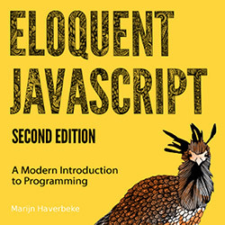
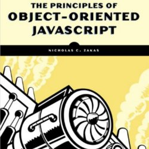

# Aqui salvo minhas observações de estudo de JS


## Observações dos Livros
Clique em um dos livro abaixo para ver as observações sobre os mesmos


| Eloquent Javasctipt| Javascript Novice to Ninja | The Principles of Object Oriented Javascript |
|--------------------|----------------------------|-----------------------------------------------|
|[](EloquentJavascript/README.md) |[](ObjectOrientedJavascript/README.md) |[](JavascriptNoviceToNinja/README.md)


# Functions

## Function Declaration
É a declaração mais comum de função, simplesmente se declara a palavra reservada **function** seguida do nome da função ex:

```javascript
function somaNumero (a, b) {
	return a+b;
}
```

**Obs:** A **Function Declaration** é carregada antes do código ser interpretado, sendo assim ela pode ser chamada no código antes mesmo de ser criada, o mesmo não acontece com a **Function Expression**, ex:

```javascript
somaNumero(2,2); //resposta 4
function somaNumero(a,b) {
  return a+b;
}
```

----------------

## Function Expression
Aqui a função será atribuída a uma variável, primeiro se declara uma variável qualquer seguida do operador de atribuição   **=**,  por fim seguido de **function** ex:

```javascript
var somaNumero = function (a, b) {
	return a+b;
}
```

**Obs:** Neste caso a função será anônima, ou seja, ela não terá nome, sua única referência é a variável para a qual ela foi definida.

**Obs2:** Diferente da **Function Declaration** a **Function Expression** precisa ser declarada antes de ser chamada pois ela só é carregada quando o código é interpretado, ex:

```javascript
somaNumero(2,2); //somaNumero is not defined
var somaNumero = function somaNumero(a,b) {
  return a+b;
}
```

----------------


## Named Function Expression
Declarada da mesma forma da **Function Expression** porém esta forma adiciona um nome para a função, ou seja, a função deixa de ser anônima ex:

```javascript
var somaNumero = function somaNumero(a, b) {
	return a+b;
}
```

**Obs:** Ela se difere da **Function Expression** principalmente no fato de que ela pode ser utlizada nas ferramentas de Debugging e Logs.

----------------


## IIFE (Imediately Invoked Function Expression)

A IIFE é invocada no momento que é interpretada, ela é uma função anônima e é o modelo ideal quando se está desenvolvendo módulos ou bibliotecas que serão utilizadas por outras pessoas, pois a IIFE encapsula todo o código e assim evita que uma variável do seu código sobrescreva alguma variável GLOBAL da aplicação, pois todas as variáveis criadas dentro da IIFE ficam no escopo local. Exemplo de uma IIFE:

Exemplo comum, sem precaução de errors:

```javascript
(function( win ) {
  return 'Hello World!';
})( window );
```

Exemplo com tratamento de precaução de erros (** ; e undefined**)

```javascript
;(function( win, undefined ) {
  return 'Hello World!';
})( window );
```
